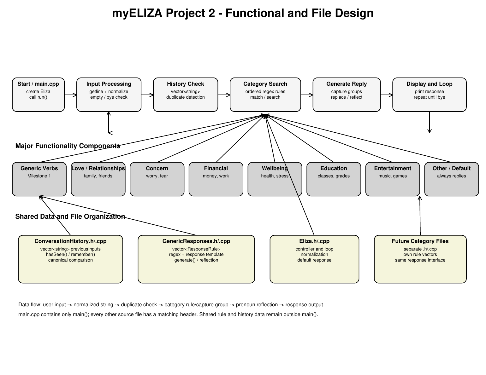

# myELIZA - High-Level System Description

myELIZA is a text-based C++ chatbot inspired by the original ELIZA psychiatrist program. The system reads a complete line of user input, normalizes it, checks whether the conversation should end, detects repeated statements, and searches category-specific regular-expression rules. When a rule matches, captured text is inserted into a response template and pronouns are reflected so the reply sounds conversational. If no rule matches, a default response guarantees that the chatbot always answers.

The Main Controller coordinates Input Processing, Conversation History, Regex and Response Generation, and the subject categories. The planned categories are Generic Verbs, Love and Relationships, Concern, Financial, Wellbeing, Education, Entertainment, and Other/Default Responses. The controller displays the chosen reply and repeats until the user enters `bye`.

The major shared data structures are a `vector<string>` of prior user inputs and vectors of `ResponseRule` objects. Each rule stores a regular-expression pattern and a response template. This structure keeps `main.cpp` small and makes new categories easy to add.

## Component Pages
- [Main Controller](Main-Controller)
- [Input Processing](Input-Processing)
- [Conversation History](Conversation-History)
- [Regex and Response Generation](Regex-and-Response-Generation)
- [Generic Verbs](Generic-Verbs)
- [Love and Relationships](Love-and-Relationships)
- [Concern](Concern)
- [Financial](Financial)
- [Wellbeing](Wellbeing)
- [Education](Education)
- [Entertainment](Entertainment)
- [Other and Default Responses](Other-and-Default-Responses)
